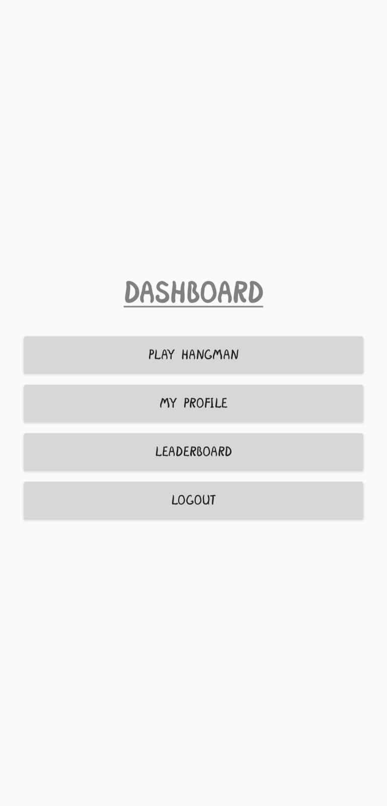
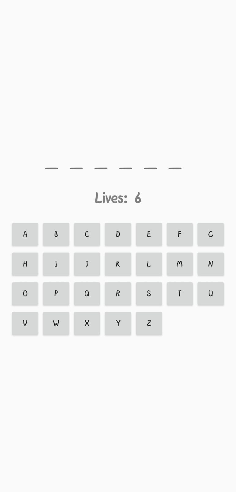
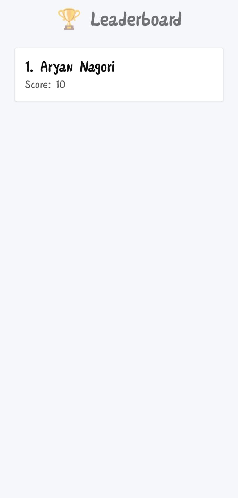

# 🪢 Hangman Firebase Android Game

An Android word-guessing game built using **Java and Firebase** where players compete on a real-time leaderboard.

---

## 📥 Download APK

---

## 🎮 Features
- Secure login & signup using Firebase Authentication
- Automatic login session
- Classic Hangman gameplay
- Score tracking system
- Live global leaderboard
- Player profile page
- Real-time database updates

---

## 📸 Screenshots

  
  
  

  
  
  

---

## 🧠 Game Flow
Launch App 
↓ 
Login / Signup 
↓ 
Dashboard 
├── Play Hangman 
├── Profile 
└── Leaderboard 

---

## 🏗️ Tech Stack

### Frontend
- Java
- XML Layouts
- RecyclerView
- CardView

### Backend
- Firebase Authentication
- Cloud Firestore

### Tools
- Android Studio
- Gradle

---

## ⚙️ Setup (Developers)

1. Clone repository
- git clone https://github.com/AryanNagori1405/Cloud-Based-Hangman-Game-Using-Firebase.git

2. Add Firebase
- Create Firebase project
- Add Android app
- Download `google-services.json`
- Place inside `app/`

3. Enable services
- Email/Password Authentication
- Firestore Database

4. Run project

---

## 👨‍💻 Author
Aryan Nagori

---

## 📄 License
Educational project
